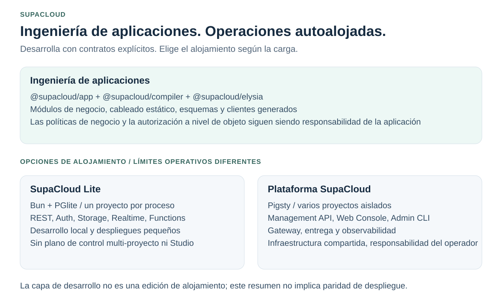
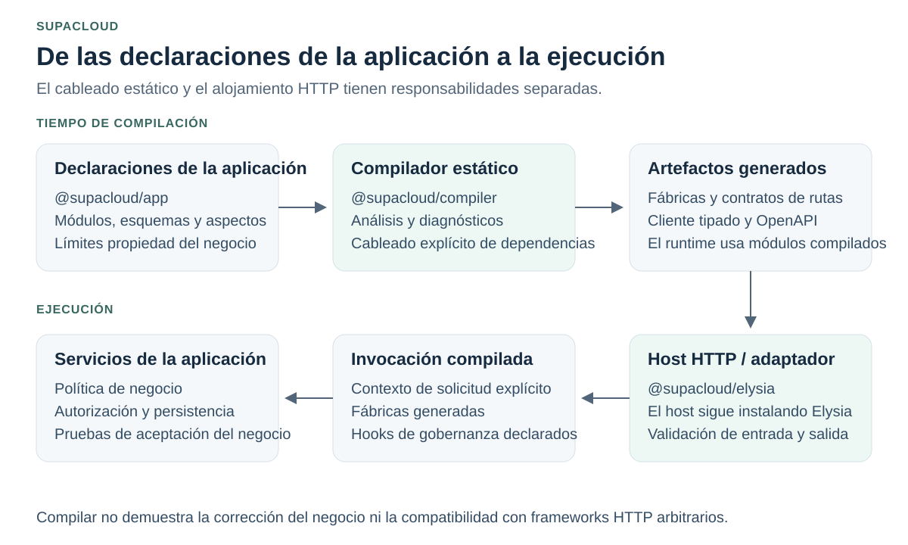
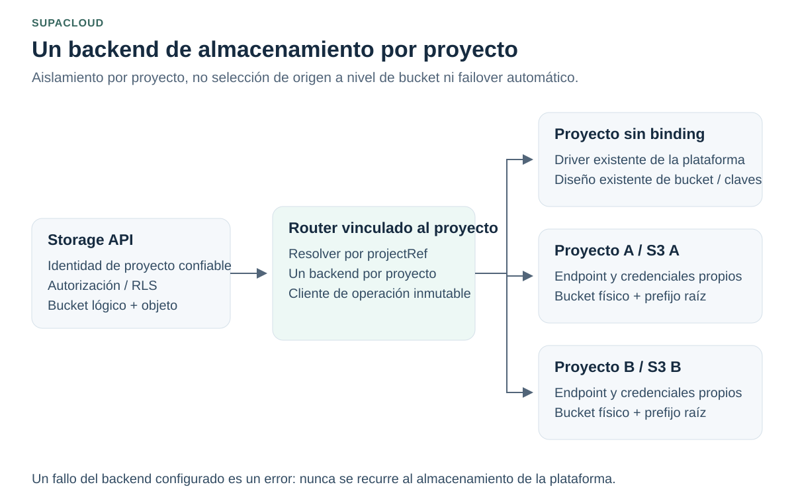

# SupaCloud

[English](README.md) | [简体中文](README.zh-CN.md) | [Español](README.es-ES.md)

**Una base de ingeniería de aplicaciones y una plataforma autoalojada para el desarrollo asistido por IA.**

Desarrolla aplicaciones con módulos explícitos, contratos estáticos y clientes generados. Ejecuta cargas de un solo proyecto con Lite o administra varios proyectos aislados de estilo Supabase en tu propia infraestructura.

[Inicio rápido](#inicio-rápido) · [Arquitectura](#arquitectura) · [Documentación](#documentación) · [Compatibilidad](#compatibilidad-y-evidencia)

El README en inglés es la fuente canónica. Consulta la [política de traducción](docs/translation-policy.md) para conocer el estado de sincronización.



<!-- section:goals -->
## Objetivos de ingeniería

| Objetivo | Enfoque |
| --- | --- |
| Bases fiables | Reutilizar contratos de ejecución, persistencia y gobernanza en lugar de reconstruir mecanismos recurrentes. |
| Desarrollo asistido por IA práctico | Starters estándar, contexto de aplicación enfocado, diagnósticos del compilador y un ciclo local de verificación. |
| Detección temprana de errores | Combinar tipos, compilación estática y esquemas en ejecución. Compilar no demuestra la corrección del negocio. |
| Aplicaciones mantenibles | Propiedad explícita de módulos y aspectos declarados estáticamente para el comportamiento transversal. |

El framework posee la estructura de la aplicación y los contratos de ejecución; la plataforma posee el aislamiento de proyectos, la integración de infraestructura y la entrega. **Las políticas de negocio, las relaciones y la autorización a nivel de objeto siguen siendo responsabilidad de la aplicación.** SupAuth es la dependencia externa de centro de identidad unificado para aplicaciones empresariales, no un sistema de usuarios que deba reconstruirse en cada aplicación. Consulta los [objetivos de ingeniería](docs/engineering-goals.md).

<!-- section:choose -->
## Elige tu punto de entrada

La **capa de ingeniería de aplicaciones** ayuda a construir un servicio. **Lite y la plataforma completa** son opciones de alojamiento, no otras dos ediciones del framework.

| Tu tarea | Punto de entrada | Límite |
| --- | --- | --- |
| Construir una aplicación de negocio modular y con tipos | [Application starter](docs/application-starter.md) | La demo no proporciona identidad, persistencia ni despliegue de producción. |
| Ejecutar un backend local-first o pequeño de un solo proyecto sin Docker | [SupaCloud Lite](packages/supacloud-lite/README.md) | Bun + PGlite; un proyecto por proceso; sin plano de control multi-proyecto ni Supabase Studio. |
| Operar varios proyectos en tus propios servidores | [Operaciones de la plataforma completa](docs/platform-operations.md) | Infraestructura Pigsty, Management API, Web Console, ciclo de vida del proyecto y responsabilidades del operador. |

La plataforma completa es un plano de control autoalojado para proyectos de estilo Supabase, no una réplica de Supabase Cloud. Consulta la [comparación detallada](docs/supacloud-vs-supabase.md) para conocer los límites del producto.

<!-- section:start -->
## Inicio rápido

<a id="server-installation"></a>
### Instalar la plataforma completa

Revisa los [requisitos del host, los límites de confianza y el procedimiento de actualización](docs/platform-operations.md) antes de ejecutar un instalador como root en un servidor:

```bash
curl -fsSL https://raw.githubusercontent.com/vibeunion/supacloud/main/setup.sh | sudo bash
```

El bootstrap procede directamente del repositorio oficial. Un proxy configurado explícitamente solo es un fallback para las descargas posteriores de Release/API. Los artefactos de Release de red requieren verificación de checksum y procedencia.

### Construir una aplicación

Usa una versión publicada de la CLI que incluya `app init` y las versiones del framework que genera. La [guía del starter](docs/application-starter.md) distingue la aceptación local de paquetes empaquetados de la publicación en npm.

```bash
npm install -g @supacloud/cli
supacloud-cli app init --root ./my-app --name my-app
cd my-app
bun install
bun run check
bun run dev
```

Esto inicia un flujo de desarrollo local, no un despliegue de producción. Sustituye la identidad de demo y los adaptadores en memoria antes de la integración; ejecuta por separado la aceptación de negocio y de base de datos.

<a id="supacloud-lite"></a>
### Ejecutar SupaCloud Lite

En un proyecto con estructura de Supabase CLI y una versión compatible de Bun:

```bash
bun add @supacloud/lite
bunx supacloud-lite start
```

En otra terminal, desde el mismo directorio:

```bash
bunx supacloud-lite keys
```

Usa la clave anónima con `@supabase/supabase-js`; nunca pongas la clave service-role en código del navegador. El estado predeterminado vive en `.supacloud-lite/`. Auth se ejecuta dentro de Bun, no en un sidecar GoTrue. Los despliegues persistentes usan el flujo documentado de `upgrade` y snapshots. Consulta la [guía de Lite](packages/supacloud-lite/README.md) para conocer la configuración, la compatibilidad y los límites de recuperación.

<a id="human-entrypoints"></a>
### Usa la CLI correcta

| Comando | Propietario y propósito |
| --- | --- |
| `supacloud-cli` | Usuarios de proyectos: desarrollo, base de datos, funciones, almacenamiento, logs y flujos de frontend. |
| `supacloud-admin` | Operadores: instalación, actualizaciones, diagnósticos SSH y ciclo de vida de proyectos de toda la plataforma. |
| `supacloudctl` | Dispatcher local opcional; no es el binario del servidor. |

`supacloud` está reservado para el binario de servidor compilado en `/usr/local/bin/supacloud`, no es un alias de la CLI de proyectos. Consulta la [guía de la CLI](docs/cli-guide.md) y la [guía de operaciones](docs/platform-operations.md) para la configuración de conexión y la invocación explícita con Bun.

<!-- section:architecture -->
## Arquitectura

### Compilación y ejecución de aplicaciones



`@supacloud/app` declara el modelo de la aplicación; `@supacloud/compiler` lo analiza y emite el cableado y los contratos; `@supacloud/elysia` aloja los módulos compilados. **El host HTTP sigue instalando Elysia.** Los metadatos de la aplicación y los módulos de negocio no necesitan importar tipos nativos de Elysia, pero las dependencias de esquemas compartidos siguen requiriendo actualizaciones coordinadas. Esto no establece portabilidad a frameworks arbitrarios ni paridad completa con las funciones nativas de Elysia.

Consulta la [guía del framework](docs/application-framework.md), la [política de dependencias](docs/elysia-compatibility.md) y los [límites de aceptación del adaptador](packages/elysia/README.md).

### Aislamiento de proyectos y almacenamiento



Cada proyecto vinculado usa **un backend compatible con S3** con su propio endpoint, credenciales, bucket físico y prefijo raíz. Todos los buckets lógicos de ese proyecto usan el binding. Los proyectos sin binding conservan su driver y diseño de objetos existentes; un binding deshabilitado, inválido o con fallos **no** recurre al almacenamiento global.

El binding es una operación de administrador. Los objetos existentes de la plataforma requieren el procedimiento documentado de adopción y una ventana de cambio sin actividad. Esto no es selección de backend a nivel de bucket, replicación, failover automático ni una afirmación de conformidad universal con proveedores. Se aplica a la plataforma completa, no a la configuración de almacenamiento independiente de Lite. Consulta [S3 por proyecto](docs/project-scoped-s3.md) para conocer los límites, la verificación y el rollback.

<!-- section:compatibility -->
## Compatibilidad y evidencia

| Superficie | Qué verificar |
| --- | --- |
| Repositorio frente a versiones publicadas | Un cambio combinado en `main` no demuestra que el paquete o binario correspondiente se haya publicado. |
| Baseline de instalación Pigsty | Los valores de instalación fijan `v4.5.0`. Sigue las [comprobaciones actuales de versión y actualización](docs/upgrade-to-pigsty-4.5.md); los identificadores históricos de migración no son la versión actual. |
| Elysia y schemas | La tupla exacta de beta/versión está en [compatibility.json](packages/elysia/compatibility.json). Los resultados reales están fechados en el [registro de aceptación](docs/framework-acceptance.md); la tupla por sí sola no es un resultado de ejecución. |
| Contratos generados | Actualiza juntos el compilador, los esquemas TypeBox, los clientes generados y los adaptadores de runtime. Regenera y ejecuta las [comprobaciones de migración de contratos](docs/route-contract-migration.md). |
| Clientes y CLI de Supabase | La compatibilidad cubre los protocolos y flujos documentados y probados, no todas las funciones de Supabase Cloud ni cada versión upstream. |
| Lite | Auth en proceso no demuestra compatibilidad completa con GoTrue. Usa la plataforma completa cuando necesites un runtime GoTrue independiente. |
| Garantías del runtime | Las pruebas en memoria no demuestran la atomicidad de PostgreSQL ni el comportamiento de un proveedor S3 real. El precalentamiento y los reintentos son mecanismos, no garantías incondicionales de latencia cero o entrega sin pérdidas. |

<!-- section:docs -->
## Documentación

| Área | Guías |
| --- | --- |
| Primeros pasos | [Application starter](docs/application-starter.md) · [Lite](packages/supacloud-lite/README.md) · [Instalación y actualizaciones](docs/platform-operations.md) |
| Ingeniería de aplicaciones | [Rutas recomendadas](docs/vibecoding-golden-paths.md) · [Framework](docs/application-framework.md) · [Objetivos de ingeniería](docs/engineering-goals.md) |
| Plataforma y almacenamiento | [Arquitectura multi-tenant](docs/architecture-multi-tenant.md) · [S3 por proyecto](docs/project-scoped-s3.md) · [Gateway](docs/gateway-customization.md) |
| Entrega y ejecución | [CLI](docs/cli-guide.md) · [Alojamiento de frontend](docs/frontend-hosting.md) · [Funciones en segundo plano](docs/background-functions.md) · [Edge runtime](docs/edge-runtime-guide.md) |
| Identidad y acceso | [Límite de autorización](docs/authorization-boundary.md) · [OAuth/OIDC por proyecto](docs/oauth-oidc-provider.md) |
| Operaciones | [Backups y PITR](docs/pigsty-backup-operations.md) · [Observabilidad](docs/observability.en.md) · [MCP de operaciones de IA solo de planificación](docs/mcp-ai-operations.md) |
| Aceptación y mantenimiento | [Aceptación del framework](docs/framework-acceptance.md) · [Preparación de arquitectura empresarial](docs/enterprise-architecture-readiness.md) · [Fuentes visuales del README](docs/readme-visuals.md) |

El [índice completo de documentación](docs/README.md) conserva APIs adicionales, guías de migración y referencias de resolución de problemas.

<a id="license"></a>
<!-- section:license -->
## Contribución y licencia

Lee [CONTRIBUTING.md](CONTRIBUTING.md) antes de enviar cambios. Mantén sincronizados los ejemplos, las traducciones y los diagramas generados; consulta el documento de [mantenimiento visual](docs/readme-visuals.md).

El código propio de SupaCloud se distribuye bajo Apache License, versión 2.0 (`Apache-2.0`). Consulta [LICENSE](LICENSE) y [NOTICE](NOTICE). Los componentes de terceros conservan sus propias licencias; las copias publicadas anteriormente conservan sus concesiones originales. Esta actualización documental no cambia la licencia.
