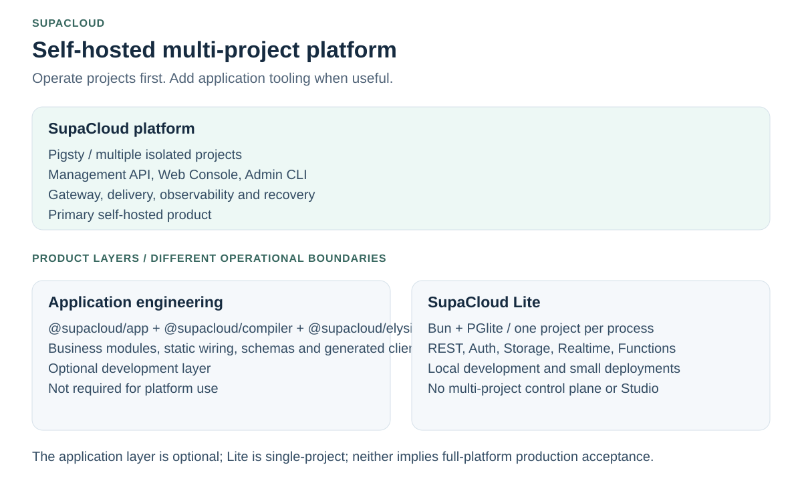
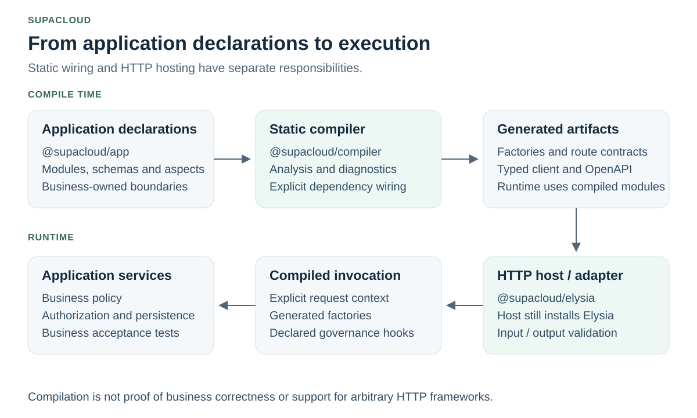
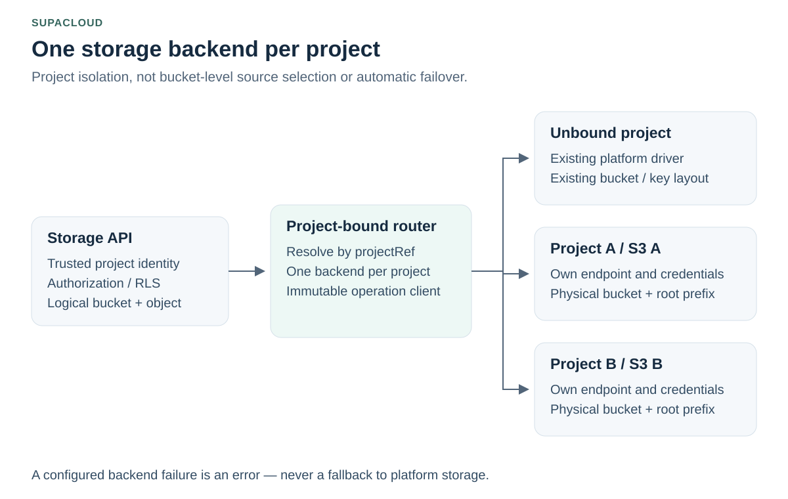

# SupaCloud

[English](README.md) | [简体中文](README.zh-CN.md) | [Español](README.es-ES.md)

**An application engineering foundation and self-hosted platform for AI-assisted development.**

Build applications with explicit modules, static contracts and generated clients. Run single-project workloads with Lite, or operate multiple isolated Supabase-style projects on your own infrastructure.

[Get started](#quick-start) · [Architecture](#architecture) · [Documentation](#documentation) · [Compatibility](#compatibility-and-evidence)

The English README is canonical. See the [translation policy](docs/translation-policy.md) for synchronization status.



<!-- section:goals -->
## Engineering goals

| Goal | Approach |
| --- | --- |
| Reliable foundations | Reuse execution, persistence and governance contracts instead of rebuilding recurring mechanics. |
| Convenient AI-assisted development | Standard starters, focused application context, compiler diagnostics and a local verification loop. |
| Earlier error detection | Combine types, static compilation and runtime schemas. Compilation is not proof of business correctness. |
| Maintainable applications | Explicit module ownership and statically declared aspects for cross-cutting behavior. |

The framework owns application structure and execution contracts; the platform owns project isolation, infrastructure integration and delivery. **Business policy, relationships and object-level authorization stay application-owned.** SupAuth is the external unified user-center dependency for enterprise applications, not a user system to rebuild in every application. See [engineering goals](docs/engineering-goals.md).

<!-- section:choose -->
## Choose your entry point

The **application engineering layer** helps build a service. **Lite and the full platform** are hosting choices, not two more framework editions.

| Your task | Entry point | Boundary |
| --- | --- | --- |
| Build a typed, modular business application | [Application starter](docs/application-starter.md) | The demo does not supply production identity, persistence or deployment. |
| Run a local-first or small single-project backend without Docker | [SupaCloud Lite](packages/supacloud-lite/README.md) | Bun + PGlite; one project per process; no multi-project control plane or Supabase Studio. |
| Operate multiple projects on your own servers | [Full platform operations](docs/platform-operations.md) | Pigsty infrastructure, Management API, Web Console, project lifecycle and operator responsibilities. |

The full platform is a self-hosted control plane for Supabase-style projects, not a replica of Supabase Cloud. Read the [detailed comparison](docs/supacloud-vs-supabase.md) for product boundaries.

<!-- section:start -->
## Quick start

### Build an application

Use a published CLI release containing `app init` and the framework versions it generates. The [starter guide](docs/application-starter.md) distinguishes local packed-package acceptance from npm publication.

```bash
npm install -g @supacloud/cli
supacloud-cli app init --root ./my-app --name my-app
cd my-app
bun install
bun run check
bun run dev
```

This starts a local development workflow, not a production deployment. Replace demo identity and in-memory adapters before integration; run business and database acceptance separately.

<a id="supacloud-lite"></a>
### Run SupaCloud Lite

In a project with a Supabase CLI layout and a supported Bun version:

```bash
bun add @supacloud/lite
bunx supacloud-lite start
```

In another terminal, from the same directory:

```bash
bunx supacloud-lite keys
```

Use the anonymous key with `@supabase/supabase-js`; never place the service-role key in browser code. Default state lives under `.supacloud-lite/`. Auth runs inside Bun, not in a GoTrue sidecar. Persistent deployments use the documented `upgrade` and snapshot workflow. Read the [Lite guide](packages/supacloud-lite/README.md) for configuration, compatibility and recovery limits.

<a id="server-installation"></a>
### Install the full platform

Review the [host prerequisites, trust boundary and upgrade procedure](docs/platform-operations.md) before executing a root installer on a server:

```bash
curl -fsSL https://raw.githubusercontent.com/vibeunion/supacloud/main/setup.sh | sudo bash
```

The bootstrap comes directly from the official repository. An explicitly configured proxy is only a fallback for subsequent Release/API downloads. Network release artifacts require checksum and provenance verification.

<a id="human-entrypoints"></a>
### Use the right CLI

| Command | Owner and purpose |
| --- | --- |
| `supacloud-cli` | Project users: development, database, functions, storage, logs and frontend workflows. |
| `supacloud-admin` | Operators: installation, upgrades, SSH diagnostics and platform-wide project lifecycle. |
| `supacloudctl` | Optional local dispatcher; not the server binary. |

`supacloud` is reserved for the compiled server binary at `/usr/local/bin/supacloud`, not a project-CLI alias. See the [CLI guide](docs/cli-guide.md) and [operations guide](docs/platform-operations.md) for connection settings and explicit Bun invocation.

<!-- section:architecture -->
## Architecture

### Application build and runtime



`@supacloud/app` declares the application model; `@supacloud/compiler` analyzes it and emits wiring and contracts; `@supacloud/elysia` hosts compiled modules. **The HTTP host still installs Elysia.** Application metadata and business modules need not import native Elysia types, but shared schema dependencies still require coordinated upgrades. This does not establish portability to arbitrary frameworks or complete native Elysia feature parity.

Read the [framework guide](docs/application-framework.md), [dependency policy](docs/elysia-compatibility.md) and [adapter acceptance boundaries](packages/elysia/README.md).

### Project isolation and storage



Each bound project uses **one S3-compatible backend** with its own endpoint, credentials, physical bucket and root prefix. All logical buckets in that project use the binding. Unbound projects retain their existing driver and object layout; a disabled, invalid or failing binding does **not** fall back to global storage.

Binding is an administrator operation. Existing platform objects require the documented adoption procedure and a quiesced cutover window. This is not bucket-level backend selection, replication, automatic failover or a universal provider-conformance claim. It applies to the full platform, not Lite's independent storage configuration. See [project-scoped S3](docs/project-scoped-s3.md) for limits, verification and rollback.

<!-- section:compatibility -->
## Compatibility and evidence

| Surface | What to verify |
| --- | --- |
| Repository vs releases | A merged change on `main` is not proof that the corresponding package or binary has been published. |
| Pigsty installation baseline | Installation defaults pin `v4.5.0`. Follow the [current pin and upgrade checks](docs/upgrade-to-pigsty-4.5.md); historical migration identifiers are not the current version. |
| Elysia and schemas | The exact beta/version tuple lives in [compatibility.json](packages/elysia/compatibility.json). Actual results are dated in the [acceptance record](docs/framework-acceptance.md); the tuple alone is not an execution result. |
| Generated contracts | Upgrade compiler, TypeBox schemas, generated clients and runtime adapters together. Regenerate and run [contract migration checks](docs/route-contract-migration.md). |
| Supabase clients and CLI | Compatibility covers documented and tested protocols/workflows, not all Supabase Cloud features or every upstream version. |
| Lite | In-process Auth does not establish full GoTrue compatibility. Use the full platform when an independent GoTrue runtime is required. |
| Runtime guarantees | Memory tests do not prove PostgreSQL atomicity or real S3-provider behavior. Preheating and retries are mechanisms, not unconditional zero-latency or lossless-delivery guarantees. |

<!-- section:docs -->
## Documentation

| Area | Guides |
| --- | --- |
| Getting started | [Application starter](docs/application-starter.md) · [Lite](packages/supacloud-lite/README.md) · [Installation and upgrades](docs/platform-operations.md) |
| Application engineering | [Golden paths](docs/vibecoding-golden-paths.md) · [Framework](docs/application-framework.md) · [Engineering goals](docs/engineering-goals.md) |
| Platform and storage | [Multi-tenant architecture](docs/architecture-multi-tenant.md) · [Project-scoped S3](docs/project-scoped-s3.md) · [Gateway](docs/gateway-customization.md) |
| Delivery and execution | [CLI](docs/cli-guide.md) · [Frontend hosting](docs/frontend-hosting.md) · [Background functions](docs/background-functions.md) · [Edge runtime](docs/edge-runtime-guide.md) |
| Identity and access | [Authorization boundary](docs/authorization-boundary.md) · [Project OAuth/OIDC](docs/oauth-oidc-provider.md) |
| Operations | [Backups and PITR](docs/pigsty-backup-operations.md) · [Observability](docs/observability.en.md) · [Plan-only AI Operations MCP](docs/mcp-ai-operations.md) |
| Acceptance and maintenance | [Framework acceptance](docs/framework-acceptance.md) · [Enterprise readiness](docs/enterprise-architecture-readiness.md) · [README visual sources](docs/readme-visuals.md) |

The [complete documentation index](docs/README.md) retains additional APIs, migration guides and troubleshooting references.

<a id="license"></a>
<!-- section:license -->
## Contributing and license

Read [CONTRIBUTING.md](CONTRIBUTING.md) before submitting changes. Keep examples, translations and generated diagrams synchronized; see [visual maintenance](docs/readme-visuals.md).

SupaCloud is licensed under the GNU Affero General Public License version 3 only (`AGPL-3.0-only`). See [LICENSE](LICENSE) and [NOTICE](NOTICE). Third-party components retain their own licenses; previously released copies retain their original grants. This documentation refresh does not change licensing.
