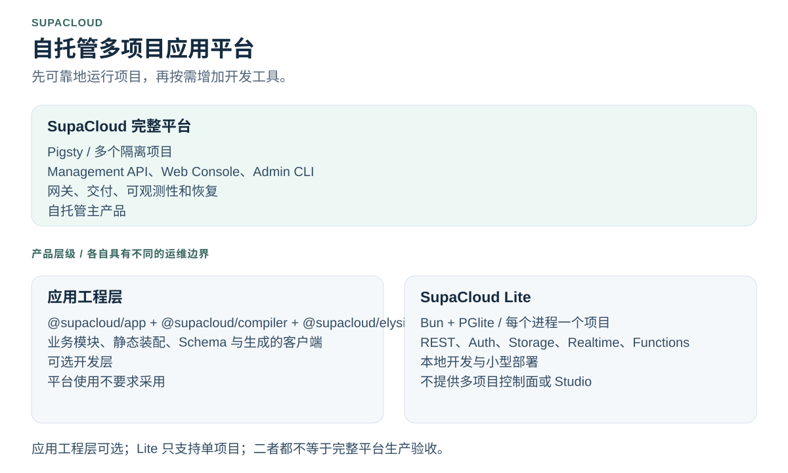
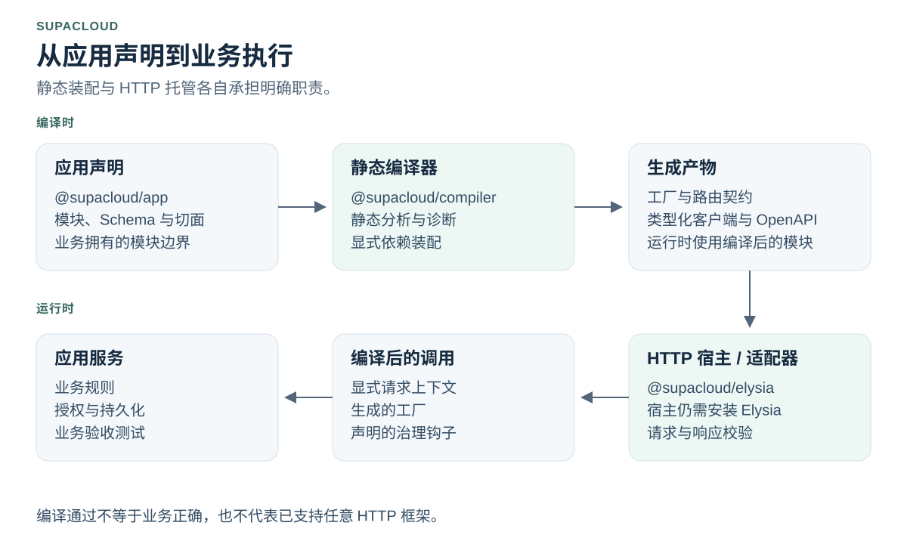
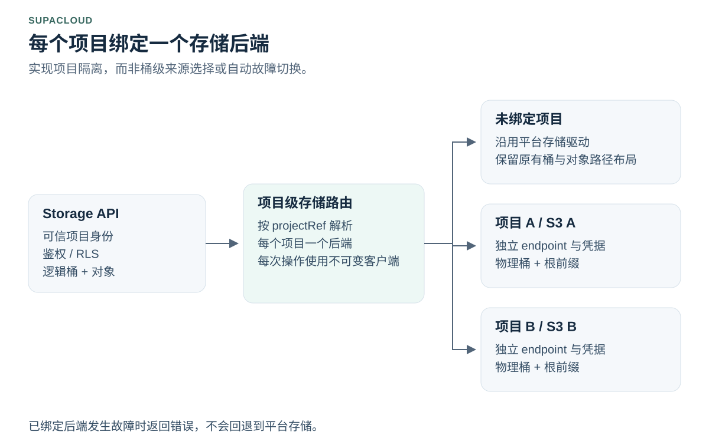

# SupaCloud

[English](README.md) | [简体中文](README.zh-CN.md) | [Español](README.es-ES.md)

**面向 AI 辅助开发的应用工程底座与自托管运行平台。**

以明确的模块、静态契约和生成的客户端组织应用开发。使用 Lite 运行单项目工作负载，或在自有基础设施上管理多个隔离的 Supabase 风格项目。

[快速开始](#快速开始) · [架构设计](#架构设计) · [文档导航](#文档导航) · [兼容性](#兼容性与验证依据)

英文 README 为权威源；同步状态见[翻译策略](docs/translation-policy.md)。



<!-- section:goals -->
## 工程目标

| 目标 | 实现思路 |
| --- | --- |
| 可靠基础层 | 复用执行、持久化与治理契约，避免重复建设相同机制。 |
| 便捷的 AI 辅助开发 | 提供标准模板、局部应用上下文、编译器诊断和本地验证循环。 |
| 提前发现错误 | 结合类型、静态编译与运行时 Schema。编译通过不等于业务正确。 |
| 大型应用可维护性 | 明确模块归属，以静态声明的切面管理横切行为。 |

框架负责应用结构与执行契约，平台负责项目隔离、基础设施集成与交付。**业务规则、业务关系与对象级授权仍由应用负责。** SupAuth 是企业应用的外部统一用户中心依赖，不应在每个应用内重复建设用户体系。详见[工程目标](docs/engineering-goals.zh-CN.md)。

<!-- section:choose -->
## 选择入口

**应用工程层**帮助开发服务；**Lite 与完整平台**是运行形态，不是另外两个框架版本。

| 你的任务 | 从这里开始 | 边界 |
| --- | --- | --- |
| 开发类型明确、模块化的业务应用 | [应用模板](docs/application-starter.md) | 演示不提供生产身份、持久化或自动部署。 |
| 无 Docker 运行本地优先或小型单项目后端 | [SupaCloud Lite](packages/supacloud-lite/README.md) | Bun + PGlite；每个进程一个项目；不提供多项目控制面或 Supabase Studio。 |
| 在自有服务器上管理多个项目 | [完整平台运维](docs/platform-operations.zh-CN.md) | 包括 Pigsty 基础设施、Management API、Web Console、项目生命周期与运维职责。 |

完整平台是面向 Supabase 风格项目的自托管控制平面，不是 Supabase Cloud 的镜像复刻。产品边界见[详细对比](docs/supacloud-vs-supabase.md)。

<!-- section:start -->
## 快速开始

### 开发应用

使用已发布且包含 `app init` 的 CLI，以及它生成的框架版本组合。[应用模板指南](docs/application-starter.md)区分了本地打包验收与 npm 正式发布。

```bash
npm install -g @supacloud/cli
supacloud-cli app init --root ./my-app --name my-app
cd my-app
bun install
bun run check
bun run dev
```

这会建立本地开发流程，并非生产部署。集成前需替换演示身份和内存适配器，另行执行真实业务与数据库验收。

<a id="supacloud-lite"></a>
### 运行 SupaCloud Lite

在具有 Supabase CLI 项目结构、使用受支持 Bun 版本的项目中运行：

```bash
bun add @supacloud/lite
bunx supacloud-lite start
```

在另一个终端进入同一目录：

```bash
bunx supacloud-lite keys
```

将匿名 key 用于 `@supabase/supabase-js`，不要把 service-role key 放入浏览器代码。默认状态保存在 `.supacloud-lite/`。Auth 内置于 Bun 进程，不会启动 GoTrue sidecar。持久化部署应使用文档规定的 `upgrade` 和快照流程。配置、兼容性与恢复边界见 [Lite 指南](packages/supacloud-lite/README.md)。

<a id="安装部署"></a>
### 安装完整平台

在服务器上执行 root 安装脚本前，先阅读[主机前提、信任边界与升级流程](docs/platform-operations.zh-CN.md)：

```bash
curl -fsSL https://raw.githubusercontent.com/vibeunion/supacloud/main/setup.sh | sudo bash
```

引导脚本直接来自官方仓库。显式配置的代理只用于后续 Release/API 下载的回退。网络 Release 产物必须完成校验和与来源证明验证。

<a id="人类入口"></a>
### 使用正确的 CLI

| 命令 | 使用者与职责 |
| --- | --- |
| `supacloud-cli` | 项目使用者：开发、数据库、函数、存储、日志和前端工作流。 |
| `supacloud-admin` | 平台运维者：安装、升级、SSH 诊断和平台级项目生命周期管理。 |
| `supacloudctl` | 可选的本地统一分发入口，不是服务端二进制。 |

`supacloud` 名称保留给 `/usr/local/bin/supacloud` 服务端二进制，不是项目 CLI 的别名。连接配置和显式 Bun 调用方式见 [CLI 指南](docs/cli-guide.md)与[运维指南](docs/platform-operations.zh-CN.md)。

<!-- section:architecture -->
## 架构设计

### 应用编译与运行



`@supacloud/app` 声明应用模型，`@supacloud/compiler` 分析并生成装配与契约，`@supacloud/elysia` 托管编译后的模块。**HTTP 宿主仍需安装 Elysia。** 应用元数据和业务模块不必导入原生 Elysia 类型，但共享 Schema 依赖仍需协同升级。这不代表已支持任意框架，也不代表与全部原生 Elysia 能力完全等价。

详见[应用框架](docs/application-framework.md)、[依赖策略](docs/elysia-compatibility.md)与[适配器验收边界](packages/elysia/README.md)。

### 项目隔离与存储



每个已绑定项目使用**一个 S3 兼容后端**，具有自己的 endpoint、凭据、物理桶和根前缀；该项目的所有逻辑桶共用这一绑定。未绑定项目保留现有驱动和对象布局。绑定被禁用、无效或出现故障时，**不会回退到全局存储**。

绑定由管理员执行。已有平台对象需要走文档规定的 adoption 流程，并在切换窗口暂停项目流量。这不是桶级后端选择、复制、自动故障切换，也不意味着已通过所有云厂商的一致性验收。该能力属于完整平台，不改变 Lite 的独立存储配置。限制、验证与回滚要求见[项目级 S3 文档](docs/project-scoped-s3.md)。

<!-- section:compatibility -->
## 兼容性与验证依据

| 范围 | 需要核实的内容 |
| --- | --- |
| 仓库与发布版本 | 代码已合并到 `main`，不等于对应软件包或二进制已发布。 |
| Elysia 与 Schema | 精确的 beta 与依赖组合见 [compatibility.json](packages/elysia/compatibility.json)。实际结果见带日期的[验收记录](docs/framework-acceptance.md)，目标组合本身不代表已执行验收。 |
| 生成契约 | 编译器、TypeBox Schema、生成客户端与运行时适配器需要协同升级；重新生成并执行[契约迁移检查](docs/route-contract-migration.md)。 |
| Supabase 客户端与 CLI | 兼容性限定在已说明、已测试的协议和工作流，不覆盖所有 Supabase Cloud 功能或全部上游版本。 |
| Lite | 进程内 Auth 不等于完整 GoTrue 兼容；需要独立 GoTrue 运行时时应使用完整平台。 |
| 运行时保证 | 内存测试不能证明 PostgreSQL 原子性或真实 S3 厂商行为。预热和重试是机制，不是无条件零延迟或请求不丢失的保证。 |

<!-- section:docs -->
## 文档导航

| 主题 | 文档 |
| --- | --- |
| 快速入门 | [应用模板](docs/application-starter.md) · [Lite](packages/supacloud-lite/README.md) · [安装与升级](docs/platform-operations.zh-CN.md) |
| 应用工程 | [推荐开发路径](docs/vibecoding-golden-paths.zh-CN.md) · [应用框架](docs/application-framework.md) · [工程目标](docs/engineering-goals.zh-CN.md) |
| 平台与存储 | [多租户架构](docs/architecture-multi-tenant.md) · [项目级 S3](docs/project-scoped-s3.md) · [网关](docs/gateway-customization.md) |
| 交付与执行 | [CLI](docs/cli-guide.md) · [前端托管](docs/frontend-hosting.md) · [后台函数](docs/background-functions.md) · [Edge Runtime](docs/edge-runtime-guide.md) |
| 身份与授权 | [授权边界](docs/authorization-boundary.md) · [项目 OAuth/OIDC](docs/oauth-oidc-provider.md) |
| 平台运维 | [备份与 PITR](docs/pigsty-backup-operations.zh-CN.md) · [可观测性](docs/observability.md) · [仅计划的 AI 运维 MCP](docs/mcp-ai-operations.zh-CN.md) |
| 验收与维护 | [框架验收](docs/framework-acceptance.md) · [企业架构就绪度](docs/enterprise-architecture-readiness.zh-CN.md) · [README 配图源文件](docs/readme-visuals.md) |

[完整文档索引](docs/README.zh-CN.md)继续提供更多 API、迁移指南与故障排查入口。

<a id="许可证"></a>
<!-- section:license -->
## 贡献与许可证

提交修改前请阅读 [CONTRIBUTING.md](CONTRIBUTING.md)。示例、多语言版本与生成的配图应同步更新，详见[配图维护说明](docs/readme-visuals.md)。

SupaCloud 采用 GNU Affero General Public License 第 3 版（仅此版本，`AGPL-3.0-only`）。详见 [LICENSE](LICENSE) 与 [NOTICE](NOTICE)。第三方组件保留各自许可证，既有发布版本保留原有授权。本次文档重构不改变许可证。
